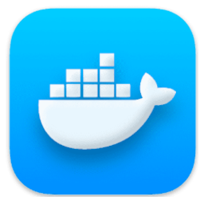

### Hello there!! I'm Geziel Carvalho! 👋

I'm a Senior Software Engineer experienced on FullStack Development.

Here's my stack:

| Backend     | Database         | Frontend    | Devops      | Mobile       |
| ----------- | ---------------- | ----------- | ----------- | ------------ |
| **.NET/C#** | **SQL Server**   | **Angular** | **Jenkins** | Android      |
| Laravel/PHP | MySQL/PostgreSQL | VueJS       | **AWS**     | iOS          |
| Node/NestJS | MongoDB          | ReactJS     | **Docker**  | React Native |

I am fluent in English 🇬🇧, with intermediate proficiency in French 🇫🇷 and native speaker of Portuguese 🇧🇷, effectively communicating with diverse stakeholders. With background in Business Management, I can excel in problem-solving, project management, software development and quality assurance. With a proven track record in developing innovative solutions, I am able to tackle new challenges and drive impactful results.

- 📫 How to reach me? You can find me on social media: @gezielcarvalho.
- ⚡ Check my [Portfolio](https://github.com/gezielcarvalho?tab=projects) to know more about my skills in action.

Let's connect and collaborate to create innovative solutions!

    
    <a href="https://www.linkedin.com/in/gezielcarvalho/">/gezielcarvalho</a>

Keywords: #SoftwareEngineer #FullStack #CSharp #Angular #Jenkins #AWS #Docker #Android #iOS #ReactNative #Laravel #PHP #NodeJS #NestJS #MongoDB #PostgreSQL #MySQL #SQLServer #VueJS #ReactJS #Typescript #Javascript #HTML #CSS #SASS #Bootstrap #MaterialDesign #Agile #Scrum #DevOps #CI/CD #TDD #Swagger #Linux
