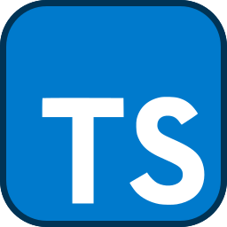

### Hello there!! I'm Geziel Carvalho! 👋

I'm a Senior Software Engineer experienced on FullStack Development.

Here's my stack:

| Backend       | Database         | Frontend    | Devops      | Mobile         |
| ------------- | ---------------- | ----------- | ----------- | ---------------|
|  **.NET/C#**  | **SQL Server**   | **VueJS**   | **Jenkins** | React Native   |
| NodeJS/NestJS | MySQL/PostgreSQL | **ReactJS** | **AWS**     | Android/WearOS |
|    Python     | MongoDB          | **Angular** | **Docker**  | iOS            |

I am fluent in **English** , with intermediate proficiency in **French** and native speaker of **Portuguese**, effectively communicating with diverse stakeholders. With background in Business Management, I can excel in problem-solving, project management, software development and quality assurance. With a proven track record in developing innovative solutions, I am able to tackle new challenges and drive impactful results.

- 📫 How to reach me? You can find me on social media: @gezielcarvalho.
- ⚡ Check my [Portfolio](https://github.com/gezielcarvalho?tab=projects) to know more about my skills in action.

Let's connect and collaborate to create innovative solutions!

---

#SoftwareEngineer #FullStack #Asp.Net #DotNet #CSharp #VueJS #ReactJS #Angular #Typescript #Jenkins #AWS #Docker #Android #iOS #ReactNative #NodeJS #MongoDB #PostgreSQL #MySQL #SQLServer #Javascript #HTML #CSS #SASS #Tailwind #Bootstrap #MaterialDesign #Agile #Scrum #DevOps #CI/CD #TDD #Swagger #Linux
